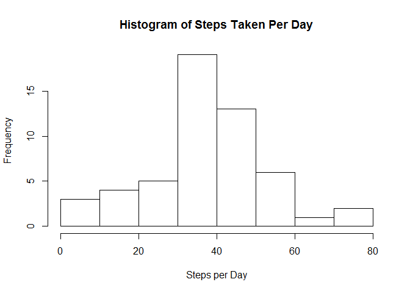
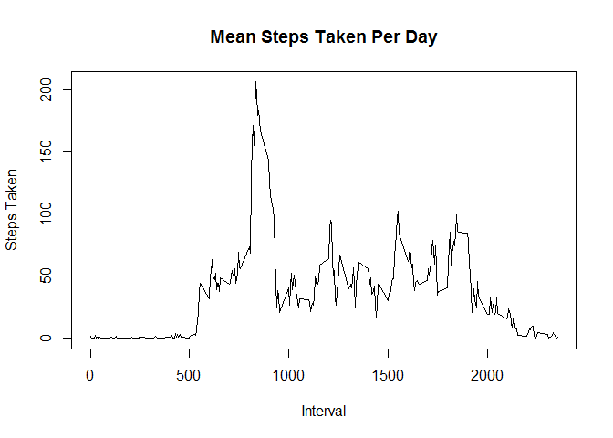
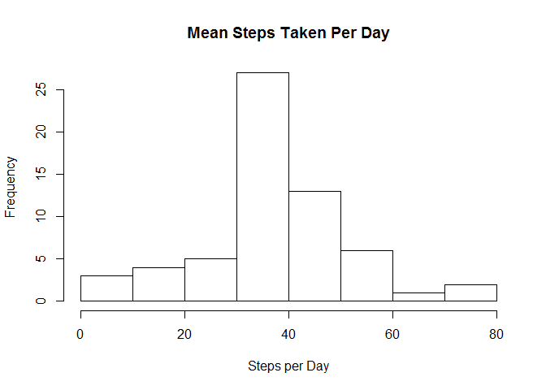
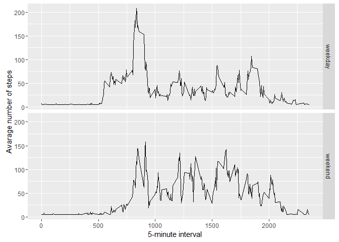

# Reproducible Research: Peer Assessment 1

```r
#Load required libraries
library(mice, quietly = TRUE, warn.conflicts = FALSE, verbose = FALSE)
```

```
## Warning: package 'mice' was built under R version 3.2.5
```

```
## Warning: package 'Rcpp' was built under R version 3.2.4
```

```
## mice 2.25 2015-11-09
```

```r
library(Hmisc, quietly = TRUE, warn.conflicts = FALSE, verbose = FALSE)
```

```
## Warning: package 'Hmisc' was built under R version 3.2.5
```

```
## Warning: package 'ggplot2' was built under R version 3.2.5
```


## Loading and preprocessing the data


```r
#unzip data
unzip("activity.zip")
#Load CSV
data <- read.csv("activity.csv")

#format date
data$date <- as.Date(data$date,"%Y-%m-%d")
```
## What is mean total number of steps taken per day?

```r
#Aggregate steps per day
meanSteps <- aggregate(steps ~ date, data, FUN = mean)
hist(meanSteps$steps, xlab = "Steps per Day", main = "Histogram of Steps Taken Per Day")
```



```r
#Mean of steps taken per day
mean(data$steps, na.rm = TRUE)
```

```
## [1] 37.3826
```

```r
#Median of steps taken per day
median(data$steps, na.rm = TRUE)
```

```
## [1] 0
```
## What is the average daily activity pattern?

```r
#five minute interval with the highest number of steps
steps.int <- aggregate(steps ~ interval, data = data, FUN = mean)

#Plot of means steps taken per day for a each interval
with(steps.int, plot(interval, steps, xlab = "Interval", ylab = "Steps Taken", main = "Mean Steps Taken Per Day", type = "l"))
```



```r
#Interval with maximum number of steps
maxSteps <- steps.int[steps.int$steps == max(steps.int$steps),]
head(maxSteps)
```

```
##     interval    steps
## 104      835 206.1698
```

## Imputing missing values

```r
#Check for NA's before imputing, 2304 steps NA
md.pattern(data)
```

```
##       date interval steps     
## 15264    1        1     1    0
##  2304    1        1     0    1
##          0        0  2304 2304
```

```r
#imputing the missing values by the mean
impData <- data
impData$steps <- with(impData, impute(steps,mean))

#Check for NA's after imputing, Now no NA
md.pattern(impData)
```

```
##      steps date interval  
## [1,]     1    1        1 0
## [2,]     0    0        0 0
```

```r
#Aggregate steps per day for imputed dataset
impDataSteps <- aggregate(steps ~ date, impData, FUN = mean)
hist(impDataSteps$steps, xlab = "Steps per Day", main = "Mean Steps Taken Per Day")
```



```r
#Mean of steps taken per day
mean(impDataSteps$steps, na.rm = TRUE)
```

```
## [1] 37.3826
```

```r
#Median of steps taken per day
median(impDataSteps$steps, na.rm = TRUE)
```

```
## [1] 37.3826
```


## Are there differences in activity patterns between weekdays and weekends?

```r
impData$dayType <-  ifelse(as.POSIXlt(impData$date)$wday %in% c(0,6), 'weekend', 'weekday')


#Plot weekdays and weekend
impData_avg <- aggregate(steps ~ interval + dayType, data=impData, mean)
ggplot(impData_avg, aes(interval, steps)) + 
    geom_line() + 
    facet_grid(dayType ~ .) +
    xlab("5-minute interval") + 
    ylab("Avarage number of steps")
```



