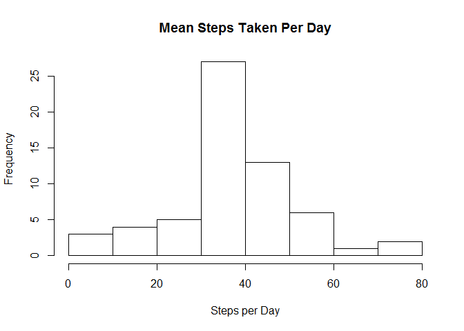

# Reproducible Research: Peer Assessment 1


## Loading and preprocessing the data


```r
unzip("activity.zip")
data <- read.csv("activity.csv")

#format date
data$date <- as.Date(data$date,"%Y-%m-%d")
```
## What is mean total number of steps taken per day?

```r
mean(data$steps, na.rm = TRUE)
```

```
## [1] 37.3826
```
## What is the average daily activity pattern?

```r
#Aggregate steps per day
meanSteps <- aggregate(steps ~ date, data, FUN = mean)
with(meanSteps, plot(date, steps, type="l"))
```


## Imputing missing values

```r
#using the mice package
library(mice)
```

```
## Warning: package 'mice' was built under R version 3.2.5
```

```
## Loading required package: Rcpp
```

```
## Warning: package 'Rcpp' was built under R version 3.2.4
```

```
## mice 2.25 2015-11-09
```

```r
library(Hmisc)
```

```
## Warning: package 'Hmisc' was built under R version 3.2.5
```

```
## Loading required package: lattice
```

```
## Loading required package: survival
```

```
## Loading required package: Formula
```

```
## Loading required package: ggplot2
```

```
## Warning: package 'ggplot2' was built under R version 3.2.5
```

```
## 
## Attaching package: 'Hmisc'
```

```
## The following objects are masked from 'package:base':
## 
##     format.pval, round.POSIXt, trunc.POSIXt, units
```

```r
#Check for NA's before imputing, 2304 steps NA
md.pattern(data)
```

```
##       date interval steps     
## 15264    1        1     1    0
##  2304    1        1     0    1
##          0        0  2304 2304
```

```r
#imputing the missing values by the mean
impData <- data
impData$steps <- with(impData, impute(steps,mean))

#Check for NA's after imputing, Now no NA
md.pattern(data)
```

```
##       date interval steps     
## 15264    1        1     1    0
##  2304    1        1     0    1
##          0        0  2304 2304
```


## Are there differences in activity patterns between weekdays and weekends?

```r
#Plot weekdays and weekend
weekd <- data[!(weekdays(as.Date(data$date)) %in% c('Saturday','Sunday')),]
weekd_avg <-aggregate(steps ~ interval, data = weekd, FUN = mean)

weeke <- data[(weekdays(as.Date(data$date)) %in% c('Saturday','Sunday')),]
weeke_avg <-aggregate(steps ~ interval, data = weeke, FUN = mean)

par(mfrow = c(2,1), mar=c(4,2,2,1))
with(weekd_avg, plot(interval,steps, main="Weekdays", type = "l"))
with(weeke_avg, plot(interval,steps, main="Weekend", type = "l"))
```



